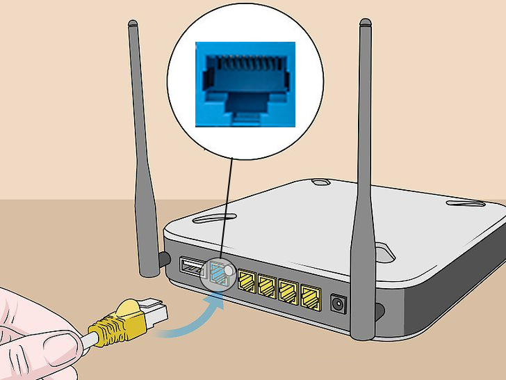
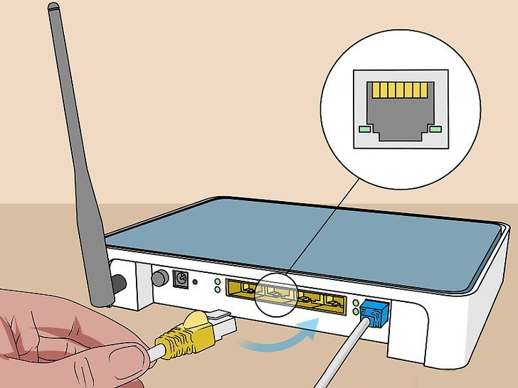
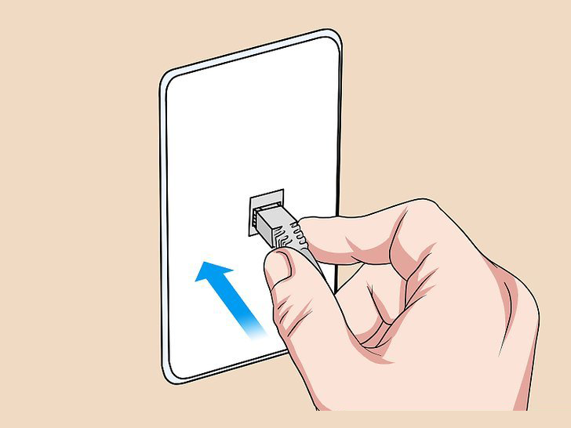
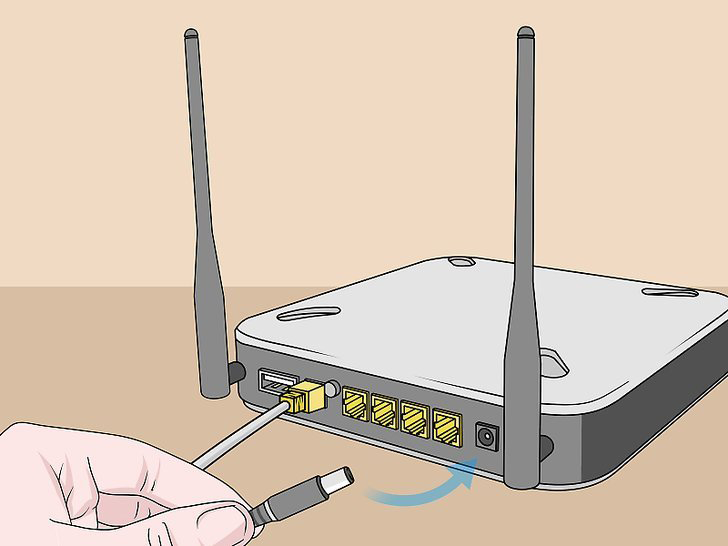
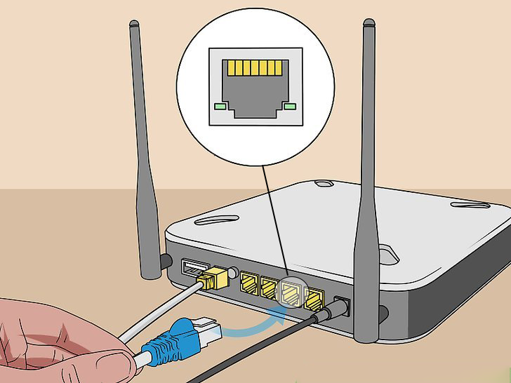
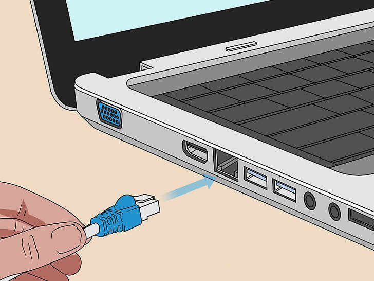
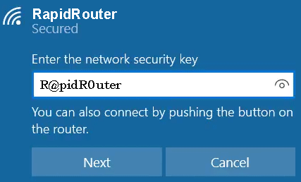
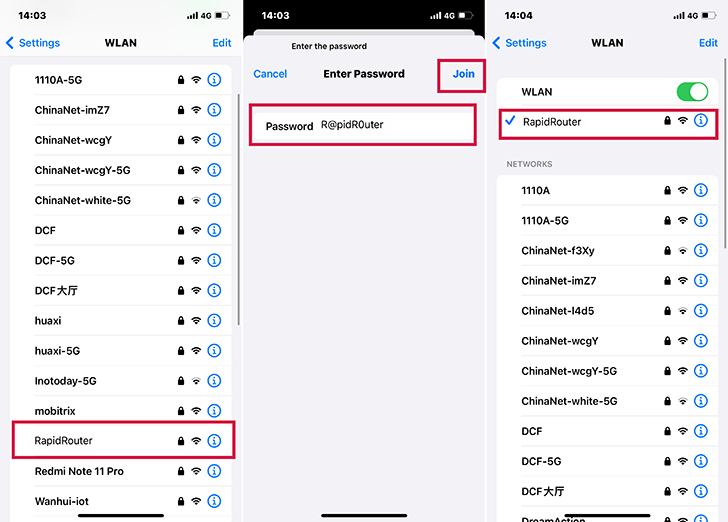

# Rapid Router Tutorial

## Step 1. Connect Ethernet Cable

1.1 Connect ethernet cable to router WAN port (Blue)

1.2 The other end to your existing router or modem.

If you have a wall port, then connect to the wall port.

## Step 2. Connect Power Cord

2.1 Plug the power cord into the router.

2.2 Then connect it to the wall plug (or other ones)

## Step 3. Start Using

3.1 For LAN connection, plug ethernet cable to Rapid Router’s LAN port.
    

    
3.2 Plug the other end to your computer.
    

    

3.3 For WIFI Connection

3.4 Input password: R@pidR0uter for WIFI name: RapidRouter on computer

3.5 Input password: R@pidR0uter for WIFI name: RapidRouter on iPhone/Android/iPad etc.

